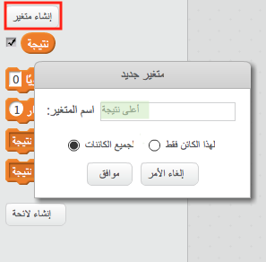
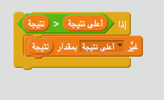

لا شك أنه من الممتع تتبع أعلى نتيجة في اللعبة.

لنفترض أن لديك متغيرًا يُسمى `نتيجة`، معينًا إلى القيمة صفر في بداية كل لعبة.

أضف متغيرًا آخر يُسمى `أعلى نتيجة`.

في نهاية اللعبة (أو عندما تريد تحديث أعلى نتيجة)، ستحتاج إلى التحقق مما إذا كان لديك `نتيجة عالية` جديدة ام لا.

