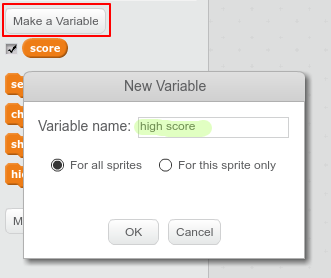

গেমসে "সর্বোচ্চ স্কোর" এর রেকর্ড রাখা মজার ব্যাপার।

`` মনে করুন একটি ভেরিয়েবল "স্কোর" আছে যার মান খেলার শুরুতে শূন্য থাকবে 

`` "সর্বোচ্চ স্কোর" নামে একটি ভেরিয়েবল যোগ করুন।

`` গেমের শেষে (অথবা যখন "সর্বোচ্চ স্কোর" পরিবর্তন করতে চান), যতবার নতুন "সর্বোচ্চ স্কোর" হবে ততবার আপনাকে যাচাই করতে হবে।

