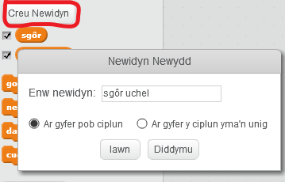
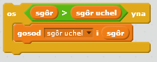

Mae'n hwyl cadw olrhain sgôr uchel mewn gêm.

Dywedwch fod gennych newidyn o'r enw `sgôr`, sy'n cael ei osod i sero ar ddechrau pob gêm.

Ychwanegu newidyn arall o'r enw `sgôr uchel`.

Ar ddiwedd y gêm (neu pryd bynnag yr ydych am ddiweddaru'r sgôr uchel), bydd angen i chi wirio a oes gennych chi sgôr uchel ``.

