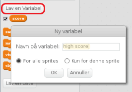
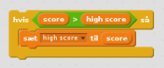

Det er sjovt at holde øje med en høj score i et spil.

Lad os sige, at du har en variabel kaldet `score`, som bliver sat til nul i begyndelsen af ​​hvert spil.

Tilføj en anden variabel kaldet `high score`.

I slutningen af ​​spillet (eller når du vil opdatere highscore), skal du kontrollere, om du har en ny `high score`.

