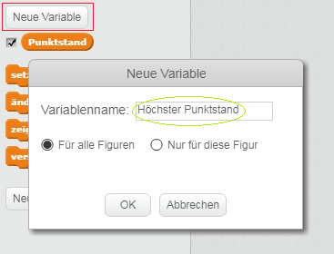
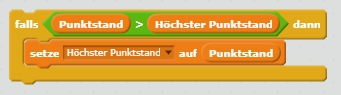

Es macht Spaß, die höchste Punktzahl in einem Spiel zu verfolgen.

Nehmen wir an. du hast eine Variable namens `Punktzahl`, die zu Beginn von jedem Spiel auf Null gesetzt wird.

Füge eine weitere Variable mit dem Namen `Höchste Punktzahl` hinzu.

Am Ende des Spiels (oder wenn du die höchste Punktzahl aktualisieren willst) musst du überprüfen, ob du eine neue `Höchste Punktzahl` hast.

