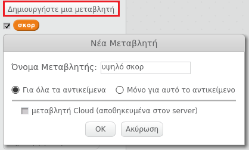
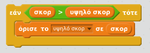

Είναι διασκεδαστικό να παρακολουθείς το υψηλότερο σκορ σε ένα παιχνίδι.

Ας υποθέσουμε ότι έχεις μία μεταβλητή που ονομάζεται `σκορ`, η οποία έχει την τιμή μηδέν στην αρχή κάθε παιχνιδιού.

Πρόσθεσε μία άλλη μεταβλητή που ονομάζεται `υψηλό σκορ`.

Στο τέλος του παιχνιδιού (ή όποτε θέλεις να ενημερώνεις το υψηλότερο σκορ), θα πρέπει να ελέγχεις αν έχεις ένα νέο `υψηλό σκορ`.

