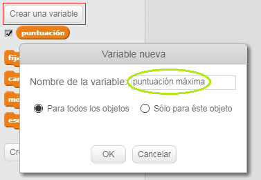
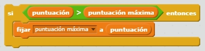

Es divertido hacer un seguimiento de un puntaje alto en un juego.

Supongamos que tiene una variable llamada | 123_6_0_321 | puntuación | 123_7_1_321 |, que se pone a cero al comienzo de cada juego.

Agregue otra variable llamada | 123_6_0_321 | puntaje más alto | 123_7_1_321 |.

Al final del juego (o cuando quieras actualizar el puntaje más alto), necesitarás verificar si tienes un nuevo | 123_6_0_321 | puntaje alto | 123_7_1_321 |.

