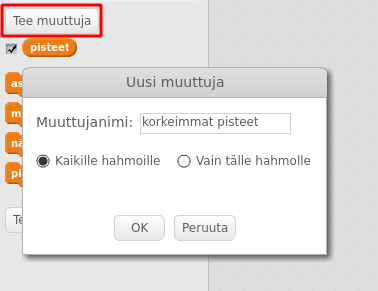
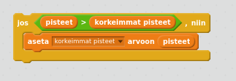

On hauskaa seurata korkeaa pistemäärää pelissä.

Oletetaan, että sinulla on muuttuja `pisteet`, joka nollataan kunkin pelin alussa.

Lisää uusi muuttuja `korkein pistemäärä`.

Pelin lopussa (tai kun haluat päivittää korkean pistemäärän), sinun on tarkistettava, onko sinulla uusi `korkein pistemäärä`.

