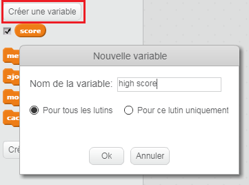
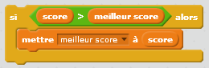

C'est amusant de garder une trace d'un score élevé dans un jeu.

Disons que tu as une variable appelée `score`, qui est mise à zéro au début de chaque partie.

Ajoute une autre variable appelée `high score`.

A la fin du jeu (ou chaque fois que tu veux mettre à jour le score le plus élevé), tu devras vérifier si tu as un nouveau `score élevé`.

