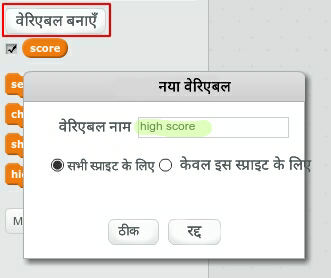
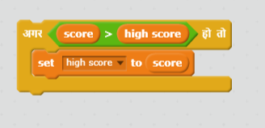

गेम में उच्च स्कोर पर ध्यान देना मज़ेदार होता है। 

मान लें आपके पास `score` नामक वेरिएबल है, जो प्रत्येक गेम के आरंभ में शून्य पर सेट होता है। 

`high score` नामक अन्य वेरिएबल शामिल करें। 

गेम की समाप्ति पर (या जब भी आप उच्च स्कोर को अपडेट करना चाहें), आपको यह देखना चाहिए कि क्या आपने अपना नया `उच्च स्कोर` बनाया है। 

