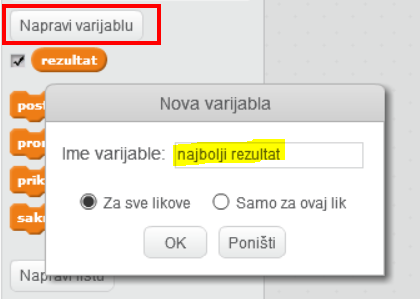
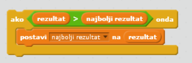

Zabavno je pratiti najbolji rezultat u igri.

Pretpostavimo da imaš varijablu nazvanu `rezultat`, koja se na početku svake igre postavlja na nulu.

Dodaj drugu varijablu nazvanu `najbolji rezultat`.

Na kraju igre (ili kad god želiš promijeniti najbolji rezultat), trebaš provjeriti imaš li novi `najbolji rezultat`.

