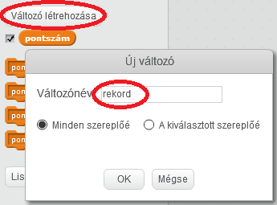
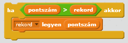

Egy játékban szórakoztató kihívás megdönteni a rekordot.

Tegyük fel, hogy van egy `pontszám` nevű változó, amely minden játék elején nullára áll.

Adj hozzá egy újabb változót, amelyet `rekord`-nak nevezel.

A játék végén (vagy bármikor, amikor frissíteni szeretnéd a rekordot), ellenőrizned kell, hogy a pontszám nagyobb-e, mint a `rekord`.

