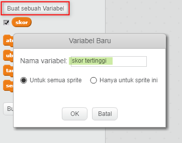
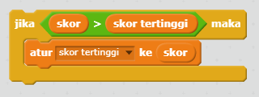

Sangat menyenangkan untuk melacak skor tertinggi dalam permainan.

Misalkan Kamu memiliki sebuah variabel yang disebut `skor`, yang akan diset ke nol pada awal setiap permainan.

Tambahkan variabel lain yang disebut `skor tertinggi`.

Di akhir permainan (atau kapan pun Kamu ingin memperbarui skor tertinggi), Kamu harus memeriksa apakah Kamu memiliki nilai tertinggi `baru`.

