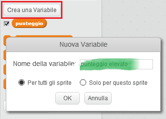
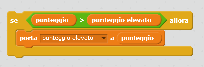

Riuscire a tenere traccia di un punteggio elevato in una partita è molto divertente.

Supponiamo che tu abbia una variabile chiamata `punteggio`, che all'inizio di ogni partita è pari a zero.

Aggiungi un'altra variabile chiamata `punteggio elevato`.

Alla fine del gioco (o quando vuoi aggiornare il punteggio più alto), dovrai verificare se hai un raggiunto un nuovo `punteggio elevato`.

