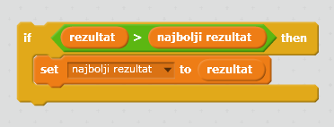

Zabavno je pratiti najbolji rezultat u igri.

Recimo da imaš promjenljivu (variable) pod nazivom `rezultat`, koja se na početku svake igre postavlja na nulu.

Dodaj još jednu promjenljivu pod nazivom `najbolji rezultat`.

Na kraju igre (ili svaki put kada želiš da ažuriraš najbolji rezultat), treba da provjeriš da li imaš novi `najbolji rezultat`.

