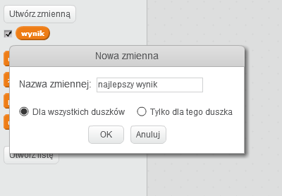
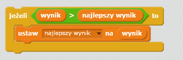

Fajnie jest śledzić wysoki wynik w grze.

Załóżmy, że masz zmienną o nazwie `wynik`, która zostanie ustawiona na zero na początku każdej gry.

Dodaj kolejną zmienną o nazwie `wysoki wynik`.

Pod koniec gry (lub gdy chcesz zaktualizować wysoki wynik), musisz sprawdzić, czy masz nowy `wysoki wynik`.

