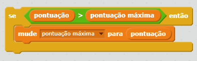

É divertido acompanhar uma alta pontuação em um jogo.

Digamos que você tenha uma variável chamada `de pontuação`, que é definido como zero no início de cada jogo.

Adicione outra variável chamada `alta pontuação`.

No final do jogo (ou sempre que quiser atualizar a alta pontuação), você precisará verificar se você possui uma nova pontuação ``.

