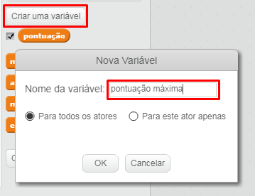

É divertido acompanhar a pontuação máxima em um jogo.

Digamos que você tenha uma variável chamada de `pontuação`, que é zerada no início de cada jogo.

Adicione outra variável chamada `pontuação máxima`.

No final do jogo (ou sempre que quiser atualizar a pontuação máxima), você precisará verificar se a `pontuação máxima` foi ultrapassada.

