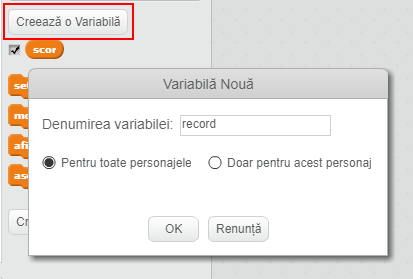
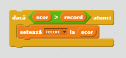

Este distractiv să țineți evidența recordurilor într-un joc.

Să presupunem că aveți o variabilă numită `scor`, care primește valoarea zero la începutul fiecărui joc.

Adăugați o altă variabilă numită `record`.

La sfârșitul jocului (sau oricând doriți să actualizați recordul), va trebui să verificați dacă aveți un nou `record`.

