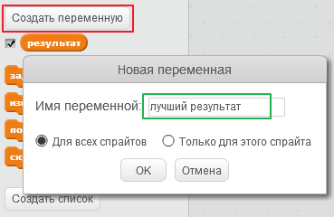
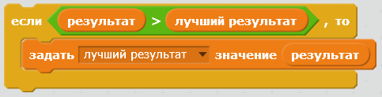

Приятно знать лучший результат в игре - максимум баллов, которого удалось достичь игрокам.

Допустим, у тебя есть переменная с именем `результат`, которая устанавливается в ноль в начале каждой игры.

Добавь еще одну переменную с именем `лучший результат`.

В конце игры (или всякий раз, когда ты хочешь обновить сведения о лучшем результате), тебе нужно проверить, есть ли у тебя новый `лучший результат`.

