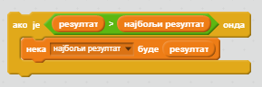

Забавно је пратити најбољи резултат у игри.

Рецимо да имате променљиву названу `резултат`, која се на почетку сваке игре постави на нулу.

Додајте другу променљиву која се зове `најбољи резултат`.

На крају игре (или кад год желите да ажурирате најбољи резултат), мораћете да проверите да ли имате нови `најбољи резултат`.

