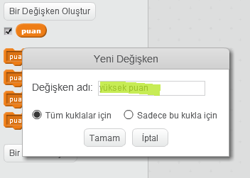
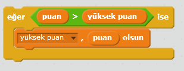

Bir oyunda yüksek bir skoru takip etmek eğlencelidir.

Her oyunun başında sıfıra ayarlanan `puan`denen bir değişkeniniz olduğunu varsayalım.

`yüksek puan`adlı başka bir değişken ekleyin.

Oyunun sonunda (veya yüksek puanı güncellemek istediğinizde), yeni bir `yüksek skor`olup olmadığını kontrol etmeniz gerekir.

