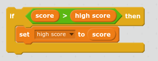

کھیل میں ایک اعلی سکور کا تعاقب رکھنے کا مزہ ہے.

آتے ہیں کہ آپ کو `سکور`کہا جاتا متغیر ہے، جو ہر کھیل کے شروع میں صفر پر جاتا ہے.

`اعلی سکور`نامی ایک اور متغیر شامل کریں.

کھیل کے اختتام پر (یا آپ کے اعلی اسکور کو اپ ڈیٹ کرنا چاہتے ہیں جب بھی)، آپ کو چیک کرنے کے لئے آپ کو ایک نیا ہے کہ آیا کی ضرورت ہو گی `اعلی سکور`.

