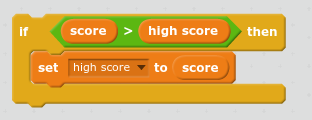

Thật thú vị khi theo dõi điểm số cao trong trò chơi.

Giả sử bạn có một biến được gọi là `điểm`, được đặt thành 0 ở đầu mỗi trò chơi.

Thêm một biến số khác gọi là `điểm cao`.

Vào cuối trò chơi (hoặc bất cứ khi nào bạn muốn cập nhật điểm số cao), bạn sẽ cần phải kiểm tra xem bạn có `điểm cao mới`.

